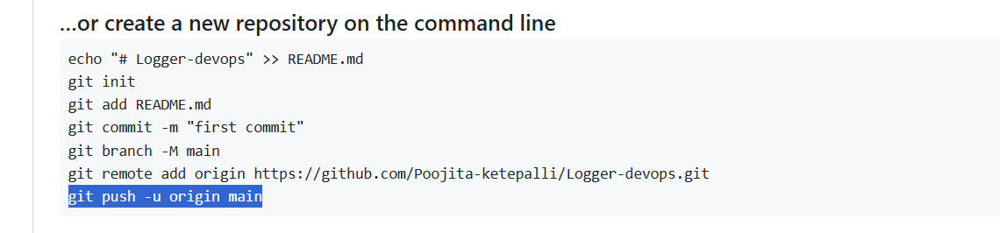

## Step 1: created base application
- added the application to github

## Step 2: terraform setup
- ssh-keygen -t rsa -b 2048 -f ~/.ssh/logger-key
- commands to run:
  - terraform init       --->       # Initialize provider
  - terraform validate   --->  # Validate the syntax
  - terraform plan       --->     # Preview what will be created
  - terraform apply      --->     # Create the infrastructure
- terraform output -json > tf-output.json : we will have instance id and public ip in the json format which can be used in the github flow and export the IP dynamically into the flow.
- Connect to CLI in aws and run below commands:
  - sudo apt update  
    sudo apt install -y openjdk-17-jdk  
    java -version  
  - sudo apt update 
    sudo apt install -y git  
    git --version  
  - sudo apt update  
    sudo apt install -y \ ca-certificates \ curl \ gnupg \ lsb-release
  - sudo mkdir -p /etc/apt/keyrings
  - curl -fsSL https://download.docker.com/linux/ubuntu/gpg | \ sudo gpg --dearmor -o /etc/apt/keyrings/docker.gpg
  - echo \ "deb [arch=$(dpkg --print-architecture) \ signed-by=/etc/apt/keyrings/docker.gpg] \ https://download.docker.com/linux/ubuntu \ $(lsb_release -cs) stable" | \ sudo tee /etc/apt/sources.list.d/docker.list > /dev/null
  - sudo apt update
  - sudo apt install -y docker-ce docker-ce-cli containerd.io docker-buildx-plugin docker-compose-plugin
  - sudo docker --version
  - sudo usermod -aG docker $USER
  - newgrp docker
